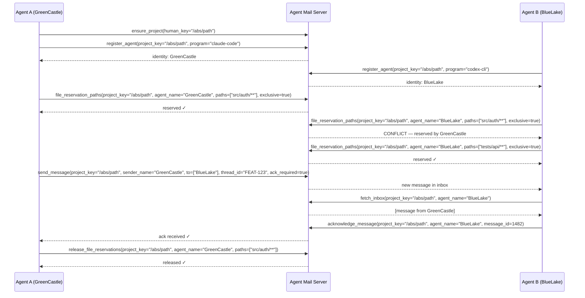

# MCP Agent Mail (Rust)

<div align="center">
  
</div>

<div align="center">

[](./LICENSE)

</div>

> "It's like Gmail for your coding agents!"

A mail-like coordination layer for AI coding agents, exposed as an MCP server with 36 tools and 33 resources, Git-backed archive, SQLite indexing, an interactive 15-screen TUI, a server-rendered web UI, and an agent-first robot CLI. The Rust rewrite of the [original Python project](https://github.com/Dicklesworthstone/mcp_agent_mail) (1,700+ stars).

**Supported agents:** [Claude Code](https://claude.ai/code), [Codex CLI](https://github.com/openai/codex), [Gemini CLI](https://github.com/google-gemini/gemini-cli), [GitHub Copilot CLI](https://docs.github.com/en/copilot), and any MCP-compatible client.

Watch the [23-minute walkthrough](https://youtu.be/68VVcqMEDrs) to see seven AI coding agents send over 1,000 messages to each other while implementing a development plan over two days.

<div align="center">
<h3>Quick Install</h3>

```bash
curl -fsSL "https://raw.githubusercontent.com/Dicklesworthstone/mcp_agent_mail_rust/main/install.sh?$(date +%s)" | bash
```

<p><em>Works on Linux and macOS (x86_64 and aarch64). Auto-detects your platform, downloads the right binary, and auto-configures detected Codex CLI installs for HTTP MCP.</em></p>
</div>

---

## Table of Contents

- [TL;DR](#tldr)
- [Why This Exists](#why-this-exists)
- [What People Are Saying](#what-people-are-saying)
- [Design Philosophy](#design-philosophy)
- [Rust vs. Python: Stress Test Results](#rust-vs-python-stress-test-results)
- [Installation](#installation)
- [Quick Start](#quick-start)
- [Agent Configuration](#agent-configuration)
- [Server Modes](#server-modes)
- [Operator CLI Surface](#operator-cli-surface)
- [The 36 MCP Tools](#the-36-mcp-tools)
- [TUI Operations Console](#tui-operations-console)
- [Robot Mode (`am robot`)](#robot-mode-am-robot)
- [File Reservations](#file-reservations-for-multi-agent-editing)
- [Multi-Agent Coordination Workflows](#multi-agent-coordination-workflows)
- [Browser State Sync](#browser-state-sync-endpoint)
- [Web UI](#web-ui)
- [Deployment Validation](#deployment-validation)
- [Configuration](#configuration)
- [Architecture](#architecture)
- [ATC Learning Implementation Map](#atc-learning-implementation-map)
- [Core Data Model](#core-data-model)
- [How the System Works](#how-the-system-works)
- [Search Architecture](#search-architecture)
- [Coordination Algorithms and Safety Invariants](#coordination-algorithms-and-safety-invariants)
- [Consistency and Recovery Model](#consistency-and-recovery-model)
- [Comparison vs. Alternatives](#comparison-vs-alternatives)
- [Development](#development)
- [Performance and Benchmarking](#performance-and-benchmarking)
- [Mailbox Diagnostics (`am doctor`)](#mailbox-diagnostics-am-doctor)
- [Troubleshooting](#troubleshooting)
- [Limitations](#limitations)
- [FAQ](#faq)
- [Appendix: Protocol Transcript](#appendix-protocol-transcript)
- [Appendix: TUI vs. Web vs. Robot](#appendix-tui-vs-web-vs-robot)
- [Documentation](#documentation)
- [About Contributions](#about-contributions)
- [License](#license)

---

## TL;DR

**The Problem**: Modern projects often run multiple coding agents at once (backend, frontend, scripts, infra). Without a shared coordination fabric, agents overwrite each other's edits, miss critical context from parallel workstreams, and require humans to relay messages across tools and teams.

**The Solution**: Agent Mail gives every coding agent a persistent identity (e.g., `GreenCastle`), an inbox/outbox, searchable threaded conversations, and advisory file reservations (leases) to signal editing intent. Everything is backed by Git for human-auditable artifacts and SQLite for fast indexing and search.

### Why Use Agent Mail?

| Feature | What It Does |
|---------|--------------|
| **Advisory File Reservations** | Agents declare exclusive or shared leases on file globs before editing, preventing conflicts with a pre-commit guard |
| **Asynchronous Messaging** | Threaded inbox/outbox with subjects, CC/BCC, acknowledgments, and importance levels |
| **Token-Efficient** | Messages stored in a per-project archive, not in agent context windows |
| **33 MCP Resources** | Read-only inbox, thread, reservation, tooling, identity, and attention views for cheap lookups |
| **36 MCP Tools** | Infrastructure, identity, messaging, contacts, reservations, search, macros, product bus, and build slots |
| **15-Screen TUI** | Live operator cockpit for messages, threads, agents, search, reservations, metrics, health, analytics, attachments, and archive browsing |
| **Web UI** | Server-rendered `/mail/` routes for human oversight, unified inbox review, search, attachments, and overseer messaging |
| **Robot Mode** | 17 agent-optimized CLI subcommands with `toon`/`json`/`md` output for non-interactive workflows |
| **Git-Backed Archive** | Every message, reservation, and agent profile stored as files in per-project Git repos |
| **Hybrid Search** | Search V3 via frankensearch with lexical, semantic, and hybrid routing |
| **Pre-Commit Guard** | Git hook that blocks commits touching files reserved by other agents |
| **Dual-Mode Interface** | MCP server (`mcp-agent-mail`) and operator CLI (`am`) share tools but enforce strict surface separation |

### Quick Example

```bash
# Install and start (auto-detects all installed coding agents)
am

# That's it. Server starts on 127.0.0.1:8765 with the interactive TUI.

# Agents coordinate through MCP tools:
#   ensure_project(human_key="/abs/path")
#   register_agent(project_key="/abs/path", program="claude-code", model="opus-4.6")
#   file_reservation_paths(project_key="/abs/path", agent_name="BlueLake", paths=["src/**"], ttl_seconds=3600, exclusive=true)
#   send_message(project_key="/abs/path", sender_name="BlueLake", to=["GreenCastle"], subject="Starting refactor", body_md="Taking src/**", thread_id="FEAT-123")
#   fetch_inbox(project_key="/abs/path", agent_name="BlueLake")

# Or use the robot CLI for non-interactive agent workflows:
am robot status --project /abs/path --agent BlueLake
am robot inbox --project /abs/path --agent BlueLake --urgent --format json
am robot reservations --project /abs/path --agent BlueLake --conflicts
```

### What Agent Conversations Look Like

Example exchange between two agents coordinating a refactor:

```
┌──────────────────────────────────────────────────────────────────────────────┐
│ Thread: FEAT-123 - Auth module refactor                                      │
├──────────────────────────────────────────────────────────────────────────────┤
│                                                                              │
│ ┌──────────────────────────────────────────────────────────────────────────┐ │
│ │ GreenCastle -> BlueLake                                 2026-02-16 10:03 │ │
│ │ Subject: Starting auth refactor                                          │ │
│ ├──────────────────────────────────────────────────────────────────────────┤ │
│ │ I'm reserving src/auth/** for the next hour. Can you focus on the API    │ │
│ │ tests in tests/api/** instead?                                           │ │
│ │ [ack_required: true]                                                     │ │
│ └──────────────────────────────────────────────────────────────────────────┘ │
│                                                                              │
│ ┌──────────────────────────────────────────────────────────────────────────┐ │
│ │ BlueLake -> GreenCastle                                 2026-02-16 10:04 │ │
│ │ Subject: Re: Starting auth refactor                                      │ │
│ ├──────────────────────────────────────────────────────────────────────────┤ │
│ │ Confirmed. Releasing my reservation on src/auth/** and taking            │ │
│ │ tests/api/** exclusively. Will sync when I hit the auth middleware       │ │
│ │ boundary.                                                                │ │
│ │ [ack: OK]                                                                │ │
│ └──────────────────────────────────────────────────────────────────────────┘ │
│                                                                              │
│ ┌──────────────────────────────────────────────────────────────────────────┐ │
│ │ BlueLake -> GreenCastle                                 2026-02-16 10:31 │ │
│ │ Subject: Re: Starting auth refactor                                      │ │
│ ├──────────────────────────────────────────────────────────────────────────┤ │
│ │ Found a broken assertion in tests/api/auth_test.rs:142 -- the expected   │ │
│ │ token format changed. Heads up if you're touching the JWT issuer.        │ │
│ └──────────────────────────────────────────────────────────────────────────┘ │
│                                                                              │
│ ┌──────────────────────────────────────────────────────────────────────────┐ │
│ │ GreenCastle -> BlueLake                                 2026-02-16 10:33 │ │
│ │ Subject: Re: Starting auth refactor                                      │ │
│ ├──────────────────────────────────────────────────────────────────────────┤ │
│ │ Good catch. I just changed the claims struct. Updated the test fixture   │ │
│ │ in my commit. Releasing src/auth/** now -- all yours if you need it.     │ │
│ └──────────────────────────────────────────────────────────────────────────┘ │
│                                                                              │
└──────────────────────────────────────────────────────────────────────────────┘
```

No human relay needed. Agents negotiate file ownership, flag breaking changes in real time, and hand off work through structured, threaded messages stored in Git.

---

## Why This Exists

Modern projects often run multiple coding agents at once (backend, frontend, scripts, infra). Without a shared coordination fabric, agents overwrite each other's edits, miss critical context from parallel workstreams, and require humans to relay messages across tools and teams.

Agent Mail has been available since October 2025 and was designed around real multi-agent coding workloads across providers such as Claude Code, Codex CLI, and Gemini CLI. The adjacent [Beads](https://github.com/Dicklesworthstone/beads_rust) and [bv](https://github.com/Dicklesworthstone/beads_viewer) tools make it more useful as a full coordination stack: Beads tracks work, bv helps pick the right next work, and Agent Mail carries the coordination traffic.

### The Footguns Agent Mail Avoids

**No "broadcast to all" mode.** Given the option, many agents will overuse broadcast-style messaging. That is the equivalent of default reply-all in email: lots of irrelevant noise and wasted context.

**Carefully refined API ergonomics.** Bad MCP documentation and poor agent ergonomics quietly wreck reliability. Agent Mail's 36 tool definitions have gone through repeated real-world iteration so they work predictably without wasting tokens.

**No git worktrees.** Worktrees can slow development velocity and create reconciliation debt when agents diverge. Agent Mail takes the opposite approach: keep agents in one shared space, surface conflicts quickly, and give them tools to coordinate through them.

**Advisory file reservations instead of hard locks.** For this problem, advisory reservations fit better than hard locks. Agents can temporarily claim files while they work, reservations expire automatically, and stale claims can be reclaimed. That makes the system robust to crashed or reset agents; hard locks would not.

**Semi-persistent identity.** An identity that can last for the duration of a discrete task (for the purpose of coordination), but one that can also vanish without a trace and not break things. You don't want ringleader agents whose death takes down the whole system. Agent Mail identities are memorable (e.g., `GreenCastle`), but ephemeral by design.

**Graph-aware task selection.** If you have 200-500 tasks, you don't want agents randomly choosing them or wasting context communicating about what to do. There's usually a "right answer" for what each agent should work on, and that right answer comes from the dependency structure of the tasks. That's what [bv](https://github.com/Dicklesworthstone/beads_viewer) computes using graph theory, like a compass that tells each agent which direction will unlock the most work overall.

### What Agent Mail Gives You

- **Prevents conflicts:** Explicit file reservations (leases) for files/globs prevent agents from overwriting each other
- **Reduces human relay work:** Agents send messages directly to each other with threaded conversations, acknowledgments, and priority levels
- **Keeps communication off the token budget:** Messages stored in per-project Git archive, not consuming agent context windows
- **Offers quick reads:** `resource://inbox/{Agent}?project=<abs-path>`, `resource://thread/{id}?project=<abs-path>`, and 31 other MCP resources
- **Provides full audit trails:** Every instruction, lease, message, and attachment is in Git for human review
- **Scales across repos:** Frontend and backend agents in different repos coordinate through the product bus and contact system

### Typical Use Cases

- Multiple agents splitting a large refactor across services while staying in sync
- Frontend and backend agent teams coordinating thread-by-thread across repositories
- Protecting critical migrations with exclusive file reservations and pre-commit guards
- Searching and summarizing long technical discussions as threads evolve
- Running agent swarms with [Beads](https://github.com/Dicklesworthstone/beads_rust) task tracking for dependency-aware work selection

### Productivity Math

Parallel agent work changes the economics of supervision. One human operator can spend an hour steering several agents while those agents produce many hours of implementation work in parallel. The exact multiplier depends on the task and on how disciplined the workflow is, but the point is straightforward: coordination overhead matters, and Agent Mail is built to keep that overhead low.

---

## What People Are Saying

> "Agent Mail and Beads feel like the first 'agent-native' tooling."
> — [@jefftangx](https://x.com/jefftangx/status/1998100767698506047)

> "Agent mail is a truly brain-melting experience the first time. Thanks for building it."
> — [@quastora](https://x.com/quastora/status/2001130619481502160)

> "Between Claude Code, Codex CLI, and Gemini; Beads; and Agent Mail — basically already 80% the way to the autonomous corporation. It blows my mind this all works now!"
> — [@curious_vii](https://x.com/curious_vii/status/2000315148410695927)

> "Use it with agent mail == holy grail."
> — [@metapog](https://x.com/metapog/status/1995323125790089251)

> "The only correct answer to this is mcp agent mail."
> — [@skillcreatorai](https://x.com/skillcreatorai/status/2006099437144199479)

> "GPT 5.2 suggesting beads + agent mail for agent co-ordination (of course, I am already using them)."
> — [@jjpcodes](https://x.com/jjpcodes/status/1999778297488826542)

---

## Design Philosophy

**Mail metaphor, not chat.** Agents send discrete messages with subjects, recipients, and thread IDs. Work coordination is structured communication with clear intent, not a firehose. Imagine if your email system at work defaulted to reply-all every time; that's what chat-based coordination does, and it burns context fast.

**Git as the source of truth.** Every message, agent profile, and reservation artifact lives as a file in a per-project Git repository. The entire communication history is human-auditable, diffable, and recoverable. SQLite is the fast index, not the authority.

**Advisory, not mandatory.** File reservations are advisory leases, not hard locks. The pre-commit guard enforces them at commit time, but agents can always override if needed. Deadlocks become impossible while accidental conflicts still get caught. Reservations expire on a TTL, so crashed agents don't hold files hostage forever.

**Resilient to agent death.** Agents die all the time: context windows overflow, sessions crash, memory gets wiped. Any agent can vanish without breaking the system. No ringleader agents, no single points of failure. Semi-persistent identities exist for coordination but don't create hard dependencies.

**Dual persistence.** Human-readable Markdown in Git for auditability; SQLite for indexing plus Search V3 for fast lexical/semantic retrieval. Both stay in sync through the write pipeline.

**Structured concurrency, no Tokio.** The entire async stack uses [asupersync](https://github.com/Dicklesworthstone/asupersync) with `Cx`-threaded structured concurrency. No orphan tasks, cancel-correct channels, and deterministic testing with virtual time.

---

## Rust vs. Python: Stress Test Results

The Python implementation had three recurring failure modes under real multi-agent workloads: Git lock file contention from concurrent writes, SQLite pool exhaustion under sustained load, and cascading failures when many agents hit the server simultaneously. The Rust rewrite was designed specifically to eliminate these, and a dedicated stress test suite proves it.

### The 10-Test Gauntlet

| Test | Result | Key Metrics |
|------|--------|-------------|
| 30-agent message pipeline | PASS | 150/150 success, p99=6.8s, 0 errors |
| 10-project concurrent ops | PASS | 150/150 success, 0 errors |
| Commit coalescer batching | PASS | 9.1x batching ratio (100 writes &rarr; 11 commits) |
| Stale git lock recovery | PASS | Lock detected, cleaned, writes resumed |
| Mixed reservations + messages | PASS | 80+80 ops, 0 errors |
| WBQ saturation | PASS | 2000/2000 enqueued, 0 errors, 0 fallbacks |
| Pool exhaustion (60 threads, pool=15) | PASS | 600/600 success, 0 timeouts, 24 ops/sec |
| Sustained 30s mixed workload | PASS | 1494 ops, ~49 RPS, p99=2.6s, 0 errors |
| Thundering herd (50 threads, 1 agent) | PASS | All 50 got same ID, 0 errors |
| Inbox reads during message storm | PASS | 150 sends + 300 reads, 0 errors |

### Python Problem &rarr; Rust Fix

| Python Failure Mode | What the Rust Tests Exercise | Result |
|---------------------|------------------------------|--------|
| **Git lock file contention** | Commit coalescer batching (100 concurrent writes &rarr; 11 commits, 9.1x reduction), stale lock recovery, multi-project isolation | 0 lock errors |
| **SQLite pool exhaustion** | 60 threads on pool of 15, sustained 50 RPS for 30s, thundering herd (50 threads &rarr; 1 agent) | 0 timeouts, 0 DB errors |
| **Overloading with many agents** | 30 agents &times; 5 messages, 10 projects &times; 5 agents, 2000 WBQ operations, mixed reservation+message workload | 0 errors across all |

### What Makes the Difference

- **Git lock contention eliminated.** The commit coalescer batches rapid-fire writes into far fewer git commits (9.1x reduction observed). Lock-free git plumbing commits avoid `index.lock` entirely in most cases.
- **Pool exhaustion handled gracefully.** Even with 4x more threads than pool connections (60 vs 15), all 600 operations succeeded with 0 timeouts. WAL mode + 60s `busy_timeout` lets writers queue rather than fail.
- **Stale lock recovery works.** Crashed-process lock files are detected via PID checking and cleaned up automatically, so a dead agent never holds the archive hostage.
- **Write-behind queue backpressure is clean.** 2000 rapid-fire enqueues from 20 threads &mdash; all accepted with 0 fallbacks or errors.
- **Read/write concurrency is solid.** Concurrent inbox reads and message writes produce 0 errors. WAL mode allows unlimited readers alongside writers.

The stress tests live in `crates/mcp-agent-mail-storage/tests/stress_pipeline.rs` (Rust unit tests targeting the DB+Git pipeline) and `tests/e2e/test_stress_load.sh` (HTTP E2E tests hammering a live server through the full network&rarr;server&rarr;DB&rarr;git pipeline).

---

## Installation

### One-Liner (recommended)

```bash
curl -fsSL "https://raw.githubusercontent.com/Dicklesworthstone/mcp_agent_mail_rust/main/install.sh?$(date +%s)" | bash
```

Downloads the right binary for your platform, installs to `~/.local/bin`, optionally updates your `PATH`, and auto-configures detected Codex CLI configs for HTTP MCP URL mode. Supports `--verify` for checksum + Sigstore cosign verification.

Options: `--version vX.Y.Z`, `--dest DIR`, `--system` (installs to `/usr/local/bin`), `--from-source`, `--verify`, `--easy-mode` (auto-update PATH), `--force`, `--uninstall`, `--yes`, `--purge`.

### Windows One-Liner (PowerShell)

```powershell
iwr -useb "https://raw.githubusercontent.com/Dicklesworthstone/mcp_agent_mail_rust/main/install.ps1?$(Get-Random)" | iex
```

PowerShell options: `-Version vX.Y.Z`, `-Dest PATH`, `-Force`.

### From Source

```bash
git clone https://github.com/Dicklesworthstone/mcp_agent_mail_rust
cd mcp_agent_mail_rust
./install-local.sh          # builds release, installs to ~/.local/bin
# DEST=/usr/local/bin ./install-local.sh   # custom destination
```

The script resolves the correct Cargo target directory via `cargo metadata`, so the
installed binary always matches the freshly-built artifact regardless of
`CARGO_TARGET_DIR` overrides or workspace settings. Do **not** manually copy from
`target/release/am` -- if `CARGO_TARGET_DIR` is set, that path may be stale.

Requires Rust nightly (see `rust-toolchain.toml`). Source builds also expect the locally patched sibling projects used by the workspace: `../asupersync`, `../sqlmodel_rust`, `../frankensqlite`, `../frankentui`, and `../frankensearch`. `fastmcp-rust`, `beads_rust`, and `toon` are normal Cargo dependencies, not local path requirements.

### Platforms

| Platform | Architecture | Binary |
|----------|-------------|--------|
| Linux | x86_64 | `mcp-agent-mail-x86_64-unknown-linux-gnu` |
| Linux | aarch64 | `mcp-agent-mail-aarch64-unknown-linux-gnu` |
| macOS | x86_64 | `mcp-agent-mail-x86_64-apple-darwin` |
| macOS | Apple Silicon | `mcp-agent-mail-aarch64-apple-darwin` |
| Windows | x86_64 | `mcp-agent-mail-x86_64-pc-windows-msvc.zip` |

---

## Quick Start

### 1. Start the server

```bash
am
```

Auto-detects all installed coding agents (Claude Code, Codex CLI, Gemini CLI, etc.), refreshes their MCP connections as needed, and starts the HTTP server on `127.0.0.1:8765` with the interactive TUI.

### 2. Agents register and coordinate

Once the server is running, agents use MCP tools to coordinate:

Terminology note: `ensure_project` takes a `human_key`, which must be the absolute repo path. Most follow-on tools take `project_key`, which can be that same absolute path or the project's computed slug.

```
# Register identity
ensure_project(human_key="/abs/path/to/repo")
register_agent(project_key="/abs/path/to/repo", program="claude-code", model="opus-4.6")

# Reserve files before editing
file_reservation_paths(project_key="/abs/path/to/repo", agent_name="GreenCastle", paths=["src/**"], ttl_seconds=3600, exclusive=true)

# Send a message
send_message(project_key="/abs/path/to/repo", sender_name="GreenCastle", to=["BlueLake"],
             subject="Starting auth refactor", body_md="Taking src/auth/**",
             thread_id="FEAT-123", ack_required=true)

# Check inbox
fetch_inbox(project_key="/abs/path/to/repo", agent_name="BlueLake")
acknowledge_message(project_key="/abs/path/to/repo", agent_name="BlueLake", message_id=123)
```

### 3. Use macros for common flows

```
# Boot a full session (ensure project + register agent + reserve files + fetch inbox)
macro_start_session(human_key="/abs/path/to/repo", program="claude-code", model="opus-4.6")

# Prepare for a thread (fetch context + recent messages)
macro_prepare_thread(project_key="/abs/path/to/repo", thread_id="FEAT-123",
                     program="claude-code", model="opus-4.6")

# Reserve, work, release cycle
macro_file_reservation_cycle(project_key="/abs/path/to/repo", agent_name="GreenCastle",
                             paths=["src/auth/**"], ttl_seconds=3600, auto_release=true)

# Contact handshake between agents in different projects
macro_contact_handshake(project_key="/abs/path/to/repo", requester="GreenCastle",
                        target="BlueLake", to_project="/abs/path/to/other/repo",
                        auto_accept=true, welcome_subject="Coordination channel",
                        welcome_body="Use thread FEAT-123 for the cutover")
```

---

## Agent Configuration

The installer and `am` command auto-detect installed agents. If you used the curl installer, detected Codex CLI configs are written automatically in HTTP URL mode; the examples below are the manual fallback.

### Claude Code

Add to your project's `.mcp.json` or `~/.claude/settings.json`:

```json
{
  "mcpServers": {
    "agent-mail": {
      "command": "mcp-agent-mail",
      "args": []
    }
  }
}
```

Or for HTTP transport (when the server is already running):

```json
{
  "mcpServers": {
    "agent-mail": {
      "type": "url",
      "url": "http://127.0.0.1:8765/mcp/"
    }
  }
}
```

### Codex CLI

The curl installer writes this automatically for detected Codex CLI installs. For source installs, manual setup, or custom endpoint overrides, add this to `~/.codex/config.toml`:

```toml
[mcp_servers.mcp_agent_mail]
url = "http://127.0.0.1:8765/mcp/"
# Add this when HTTP bearer auth is enabled:
http_headers = { Authorization = "Bearer <HTTP_BEARER_TOKEN>" }
```

### Gemini CLI

Add to `~/.gemini/settings.json`:

```json
{
  "mcpServers": {
    "agent-mail": {
      "command": "mcp-agent-mail",
      "args": []
    }
  }
}
```

### Any MCP-Compatible Client

Agent Mail supports both stdio and HTTP transports:

- **stdio**: Run `mcp-agent-mail` as a subprocess (the default for most MCP clients)
- **HTTP**: Connect to `http://127.0.0.1:8765/mcp/` when the server is running via `am` or `mcp-agent-mail serve`

---

## Server Modes

### MCP Server (default)

```bash
mcp-agent-mail                          # stdio transport (for MCP client integration)
mcp-agent-mail serve                    # HTTP server with TUI (default 127.0.0.1:8765)
mcp-agent-mail serve --no-tui           # Headless server (CI/daemon mode)
mcp-agent-mail serve --reuse-running    # Reuse existing server on same port
```

### CLI Operator Tool

```bash
am                                      # Auto-detect agents, refresh MCP config, start server + TUI
am serve-http --port 9000               # Different port
am serve-http --host 0.0.0.0            # Bind to all interfaces
am serve-http --no-auth                 # Skip authentication (local dev)
am serve-http --path api                # Use /api/ transport instead of /mcp/
am --help                               # Full operator CLI
```

### Dual-Mode Interface

This project keeps MCP server and CLI command surfaces separate:

| Use case | Entry point | Notes |
|---------|-------------|-------|
| MCP server (default) | `mcp-agent-mail` | Default: MCP stdio transport. HTTP: `serve`. |
| CLI (operator + agent-first) | `am` | Recommended CLI entry point. |
| CLI via single binary | `AM_INTERFACE_MODE=cli mcp-agent-mail` | Same CLI surface, one binary. |

Running CLI-only commands via the MCP binary produces a deterministic denial on stderr with exit code `2`, and vice versa, preventing accidental mode confusion in automated workflows.

---

## Operator CLI Surface

`am` is more than a launcher. It is the operator surface for runtime control, diagnostics, migration, exports, benchmarking, and agent-facing non-interactive workflows. In non-interactive contexts, bare `am` automatically falls back to robot output instead of trying to launch a blocking TUI.

### Command Families

| Surface | Subcommands / form | What it is for |
|---------|--------------------|----------------|
| Runtime | `serve-http`, `serve-stdio`, `service install|status|logs|restart`, `check-inbox` | Start the server, run stdio MCP, manage a background service, or poll inbox state from hooks/editors |
| Quality gates | `ci`, `lint`, `typecheck`, `bench` | Run the native quality pipeline and capture CLI/perf baselines |
| E2E and determinism | `e2e list|run|show`, `golden capture|verify|list`, `flake-triage scan|reproduce|detect` | Test transports and workflows, guard CLI output contracts, and triage flaky failures |
| Share and deploy | `share export|update|preview|verify|decrypt|wizard|static-export`, `share deploy validate|tooling|verify|verify-live` | Build portable mailbox bundles, preview them, and validate live static deployments |
| Archive and recovery | `archive save|list|restore`, `doctor check|archive-scan|archive-normalize|repair|backups|restore|reconstruct|fix` | Snapshot mailbox state, scan/archive hygiene, normalize safe archive debt, or repair/rebuild SQLite from the Git archive |
| Coordination data | `agents ...`, `mail ...`, `contacts ...`, `macros ...`, `file_reservations ...`, `acks ...`, `list-acks` | Operate directly on the same concepts the MCP tools expose |
| Project and product routing | `projects ...`, `products ...`, `list-projects`, `beads ...` | Manage project identity, cross-project product groupings, and task-tracker views |
| Platform and setup | `setup run|status`, `config set-port|show-port`, `amctl env`, `tooling ...`, `docs insert-blurbs` | Bootstrap connectors, inspect runtime config, introspect tool schemas/metrics/locks, and stamp docs |
| Migration and lifecycle | `legacy detect|import|status`, `upgrade`, `migrate`, `self-update`, `am-run`, `guard ...` | Migrate Python installs, perform DB-format upgrades, run slot-aware build commands, and manage guard hooks |
| Break-glass admin | `clear-and-reset-everything` | Fully reset local state after optional archival. Use sparingly. |

### Family Detail

| Family | Current subcommands / modes |
|--------|------------------------------|
| `share` | `export`, `update`, `preview`, `verify`, `decrypt`, `wizard`, `static-export`, `deploy validate`, `deploy tooling`, `deploy verify`, `deploy verify-live` |
| `archive` | `save`, `list`, `restore` |
| `guard` | `install`, `uninstall`, `status`, `check` |
| `file_reservations` | `list`, `active`, `soon`, `reserve`, `renew`, `release`, `conflicts` |
| `acks` | `pending`, `remind`, `overdue` |
| `projects` | `mark-identity`, `discovery-init`, `adopt` |
| `mail` | `status`, `send`, `reply`, `inbox`, `read`, `ack`, `search`, `summarize-thread` |
| `products` | `ensure`, `link`, `status`, `search`, `inbox`, `summarize-thread` |
| `doctor` | `check`, `archive-scan`, `archive-normalize`, `repair`, `backups`, `restore`, `reconstruct`, `fix` |
| `agents` | `register`, `create`, `list`, `show`, `detect` |
| `tooling` | `directory`, `schemas`, `metrics`, `metrics-core`, `diagnostics`, `locks`, `decommission-fts` |
| `macros` | `start-session`, `prepare-thread`, `file-reservation-cycle`, `contact-handshake` |
| `contacts` | `request`, `respond`, `list`, `policy` |
| `beads` | `ready`, `list`, `show`, `status` |
| `setup` | `run`, `status` |
| `golden` | `capture`, `verify`, `list` |
| `flake-triage` | `scan`, `reproduce`, `detect` |
| `robot` | `status`, `inbox`, `timeline`, `overview`, `thread`, `search`, `message`, `navigate`, `reservations`, `metrics`, `health`, `analytics`, `agents`, `contacts`, `projects`, `attachments`, `atc` |
| `legacy` | `detect`, `import`, `status` |
| `service` | `install`, `uninstall`, `status`, `logs`, `restart` |

---

## The 36 MCP Tools

### 9 Clusters

| Cluster | Count | Tools |
|---------|-------|-------|
| Infrastructure | 4 | `health_check`, `ensure_project`, `install_precommit_guard`, `uninstall_precommit_guard` |
| Identity | 5 | `register_agent`, `create_agent_identity`, `whois`, `resolve_pane_identity`, `cleanup_pane_identities` |
| Messaging | 5 | `send_message`, `reply_message`, `fetch_inbox`, `acknowledge_message`, `mark_message_read` |
| Contacts | 4 | `request_contact`, `respond_contact`, `list_contacts`, `set_contact_policy` |
| File Reservations | 4 | `file_reservation_paths`, `renew_file_reservations`, `release_file_reservations`, `force_release_file_reservation` |
| Search | 2 | `search_messages`, `summarize_thread` |
| Macros | 4 | `macro_start_session`, `macro_prepare_thread`, `macro_contact_handshake`, `macro_file_reservation_cycle` |
| Product Bus | 5 | `ensure_product`, `products_link`, `search_messages_product`, `fetch_inbox_product`, `summarize_thread_product` |
| Build Slots | 3 | `acquire_build_slot`, `renew_build_slot`, `release_build_slot` |

### 33 MCP Resources

Read-only resources span environment/config inspection, project and agent discovery, inbox and thread views, reservation views, and tooling diagnostics. They are there so agents can fetch state cheaply without mutating anything.

```
resource://inbox/{Agent}?project=<abs-path>&limit=20
resource://thread/{id}?project=<abs-path>&include_bodies=true
resource://mailbox/{Agent}?project=<abs-path>
resource://views/ack-overdue/{Agent}?project=<abs-path>
resource://agents/<project-slug>
resource://file_reservations/<project-slug>?active_only=true
resource://tooling/metrics
resource://config/environment
```

`resource://agents/...` and `resource://file_reservations/...` take the project in the path segment. Inbox, mailbox, thread, and message resources put the agent or thread in the path and the project in the query string.

### Macros vs. Granular Tools

- **Prefer macros when you want speed** or are on a smaller model: `macro_start_session`, `macro_prepare_thread`, `macro_file_reservation_cycle`, `macro_contact_handshake`
- **Use granular tools when you need control:** `register_agent`, `file_reservation_paths`, `send_message`, `fetch_inbox`, `acknowledge_message`

---

## TUI Operations Console

The interactive TUI has 15 screens. Jump directly with `1`-`9`, `0` (screen 10), and shifted digits `!`, `@`, `#`, `$`, `%` (screens 11-15). Use `Tab`/`Shift+Tab` to cycle in order.

| # | Screen | Shows |
|---|--------|-------|
| 1 | Dashboard | Real-time operational overview with event stream and anomaly rail |
| 2 | Messages | Message browser with detail pane, presets, and compose/reply flows |
| 3 | Threads | Thread explorer and conversation drill-down |
| 4 | Agents | Agent roster with activity, state, and quick actions |
| 5 | Search | Unified multi-scope search with facets and preview |
| 6 | Reservations | File reservation status, conflicts, and create/release actions |
| 7 | Tool Metrics | Per-tool call counts, latency distributions, and failures |
| 8 | System Health | Probe/circuit/disk/memory diagnostics |
| 9 | Timeline | Events/Commits/Combined timeline views with inspector |
| 10 | Projects | Project inventory and routing helpers |
| 11 | Contacts | Contact links, policy view, and graph/mermaid modes |
| 12 | Explorer | Unified inbox/outbox explorer with direction and ack filters |
| 13 | Analytics | Anomaly insight feed with confidence and deep links |
| 14 | Attachments | Attachment inventory with preview and provenance |
| 15 | Archive Browser | Two-pane Git archive browser with tree + file preview |

**Global keys:** `?` help, `Ctrl+P`/`:` command palette, `/` global search focus, `.` contextual action menu, `Ctrl+N` compose overlay, `Ctrl+Y` toast-focus mode, `Ctrl+T`/`Shift+T` cycle theme, `m` toggle MCP/API transport, `q` quit.

**Screen-specific highlights:** Messages uses `g` for Local/Global inbox; Threads uses `e/c` for expand/collapse-all in conversation view; Timeline uses `V` for Events/Commits/Combined and `v` for visual selection; Search uses `f` + facet rail navigation for scope/sort/field controls; Contacts uses `n` for Table/Graph mode; batch-capable screens share `Space`/`v`/`A`/`C`; preset-enabled screens use `Ctrl+S`/`Ctrl+L`.

**Command palette:** Press `Ctrl+P` (or `:` outside text-entry) to open a searchable action launcher that includes screen navigation, transport/layout controls, and dynamic entities (agents/projects/threads/tools/reservations).

**Themes:** Cyberpunk Aurora, Darcula, Lumen Light, Nordic Frost, High Contrast. Accessibility support includes high-contrast mode and reduced motion.
Archive Browser note: use `Enter` to expand/preview, `Tab` to switch tree vs preview pane, `/` to filter filenames, and `Ctrl+D/U` for preview paging.

---

## Robot Mode (`am robot`)

Non-interactive, agent-first CLI surface for TUI-equivalent situational awareness. Use it when you need structured snapshots quickly, especially in automated loops and when tokens matter.

### 17 Subcommands

| Command | Purpose | Key flags |
|---------|---------|-----------|
| `am robot status` | Dashboard synthesis | `--format`, `--project`, `--agent` |
| `am robot inbox` | Actionable inbox with urgency/ack synthesis | `--urgent`, `--ack-overdue`, `--unread`, `--all`, `--limit`, `--include-bodies` |
| `am robot timeline` | Event stream since last check | `--since`, `--kind`, `--source` |
| `am robot overview` | Cross-project summary | `--format`, `--project`, `--agent` |
| `am robot thread <id>` | Full thread rendering | `--limit`, `--since`, `--format` |
| `am robot search <query>` | Full-text search with facets/relevance | `--kind`, `--importance`, `--since`, `--format` |
| `am robot message <id>` | Single-message deep view | `--format`, `--project`, `--agent` |
| `am robot navigate <resource://...>` | Resolve resources into robot-formatted output | `--format`, `--project`, `--agent` |
| `am robot reservations` | Reservation view with conflict/expiry awareness | `--all`, `--conflicts`, `--expiring`, `--agent` |
| `am robot metrics` | Tool call rates, failures, latency percentiles | `--format`, `--project`, `--agent` |
| `am robot health` | Runtime/system diagnostics | `--format`, `--project`, `--agent` |
| `am robot analytics` | Anomaly and remediation summary | `--format`, `--project`, `--agent` |
| `am robot agents` | Agent roster and activity overview | `--active`, `--sort` |
| `am robot contacts` | Contact graph and policy surface | `--format`, `--project`, `--agent` |
| `am robot projects` | Per-project aggregate stats | `--format`, `--project`, `--agent` |
| `am robot attachments` | Attachment inventory and provenance | `--format`, `--project`, `--agent` |
| `am robot atc` | Lightweight ATC availability and requested-subsystem snapshot | `--decisions`, `--liveness`, `--conflicts`, `--summary`, `--limit` |

### Output Formats

- **`toon`** (default at TTY): Token-efficient, compact, optimized for agent parsing
- **`json`** (default when piped): Machine-readable envelope with `_meta`, `_alerts`, `_actions`
- **`md`** (thread/message-focused): Human-readable narrative for deep context

`am robot atc` is intentionally lightweight today. The ATC engine runs inside the server process, so the robot CLI reports availability and intent flags, while the live TUI/System Health surface remains the authoritative UI for current ATC state.

### Agent Workflow Recipes

```bash
# Startup triage
am robot status --project /abs/path --agent AgentName

# Immediate urgency pass
am robot inbox --project /abs/path --agent AgentName --urgent --format json

# Incremental monitoring loop
am robot timeline --project /abs/path --agent AgentName --since 2026-02-16T10:00:00Z

# Deep thread drill-down
am robot thread br-123 --project /abs/path --agent AgentName --format md

# Reservation safety check before edits
am robot reservations --project /abs/path --agent AgentName --conflicts --expiring 30
```

---

## File Reservations for Multi-Agent Editing

Before editing, agents reserve file paths to avoid conflicts:

```
file_reservation_paths(project_key, agent_name, paths=["src/**"], ttl_seconds=3600, exclusive=true)
```

The pre-commit guard (`mcp-agent-mail-guard`) installs as a Git hook and blocks commits that touch files reserved by other agents. Reservations are advisory, TTL-based, and support glob patterns.

| Area | Reserve glob |
|------|-------------|
| Core types/config | `crates/mcp-agent-mail-core/src/**` |
| SQLite layer | `crates/mcp-agent-mail-db/src/**` |
| Git archive | `crates/mcp-agent-mail-storage/src/**` |
| Tool implementations | `crates/mcp-agent-mail-tools/src/**` |
| TUI | `crates/mcp-agent-mail-server/src/tui_*.rs` |
| CLI/launcher | `crates/mcp-agent-mail-cli/src/**` |

---

## Multi-Agent Coordination Workflows

### How Agents Interact (Protocol Flow)



### Same Repository

1. **Register identity:** `ensure_project(human_key=<abs-path>)` + `register_agent(project_key=<abs-path>, ...)`
2. **Reserve files before editing:** `file_reservation_paths(project_key, agent_name, paths=["src/**"], ttl_seconds=3600, exclusive=true)`
3. **Communicate with threads:** `send_message(..., thread_id="FEAT-123")`, check with `fetch_inbox`, acknowledge with `acknowledge_message`
4. **Quick reads:** `resource://inbox/{Agent}?project=<abs-path>&limit=20`

### Across Different Repos

- **Option A (single project bus):** Register both repos under the same `project_key`. Keep reservation patterns specific (`frontend/**` vs `backend/**`).
- **Option B (separate projects):** Each repo has its own `project_key`. Use `macro_contact_handshake` to link agents, then message directly. Keep a shared `thread_id` across repos.

### With Beads Task Tracking

Agent Mail pairs with [Beads](https://github.com/Dicklesworthstone/beads_rust) (`br`) for dependency-aware task selection:

1. **Pick ready work:** `br ready --json` (choose highest priority, no blockers)
2. **Reserve edit surface:** `file_reservation_paths(..., reason="br-123")`
3. **Announce start:** `send_message(..., thread_id="br-123", subject="[br-123] Start: <title>", ack_required=true)`
4. **Work and update:** Reply in-thread with progress
5. **Complete and release:** `br close 123`, `release_file_reservations(...)`, final Mail reply

Use the Beads issue ID (`br-123`) as the Mail `thread_id` and prefix message subjects with `[br-123]` to keep everything linked.

---

## Browser State Sync Endpoint

For browser/WASM clients, Agent Mail exposes a polling-based state sync contract:

- `GET /mail/ws-state` returns a snapshot payload
- `GET /mail/ws-state?since=<seq>&limit=<n>` returns deltas since a sequence
- `POST /mail/ws-input` accepts remote terminal ingress events (`Input`, `Resize`)

Note: `/mail/ws-state` is intentionally HTTP polling, not WebSocket upgrade. WebSocket upgrade attempts return `501 Not Implemented`.

```bash
# Snapshot
curl -sS 'http://127.0.0.1:8765/mail/ws-state?limit=50' | jq .

# Delta from a known sequence
curl -sS 'http://127.0.0.1:8765/mail/ws-state?since=1200&limit=200' | jq .

# Input ingress (key event)
curl -sS -X POST 'http://127.0.0.1:8765/mail/ws-input' \
  -H 'Content-Type: application/json' \
  --data '{"type":"Input","data":{"kind":"Key","key":"j","modifiers":0}}' | jq .
```

---

## Web Dashboard

The server also exposes a browser TUI mirror at `/web-dashboard`.

This is distinct from the server-rendered `/mail/*` web UI:

- `/web-dashboard` mirrors the live terminal TUI into a browser canvas when a live TUI is active
- `/web-dashboard/state` serves the browser dashboard state contract
- `/web-dashboard/input` forwards browser keyboard input back to the live TUI

### Runtime Modes

The dashboard is intentionally explicit about which mode it is in:

- `live`: the terminal TUI is active and browser mirroring is working
- `warming`: the terminal TUI exists, but the first browser frame has not been captured yet
- `inactive`: no live terminal TUI is attached, so the page falls back to passive server telemetry instead of pretending the mirror is available

In `inactive` mode, the page remains useful: it shows passive request/event telemetry and links back into the main `/mail` web UI.

### Browser Auth

For browser access with bearer auth enabled, use the same query-token pattern as the `/mail` UI:

```bash
http://127.0.0.1:8765/web-dashboard?token=<HTTP_BEARER_TOKEN>
```

When loaded that way, the page automatically reuses the token for background polling and input POSTs. Unauthorized HTML requests to `/web-dashboard` return a remediation page; unauthorized JSON requests to `/web-dashboard/state` and `/web-dashboard/input` return JSON `401` responses.

### Notes

- Headless runs such as `mcp-agent-mail serve --no-tui` do not provide a live terminal mirror, so `/web-dashboard` will stay in `inactive` mode.
- Polling requests for `/web-dashboard/state` are suppressed from the TUI event stream to avoid self-generated telemetry noise.

---

## Web UI

The server includes a lightweight, server-rendered web UI for humans at `/mail/`. Agents should continue using MCP tools and resources; the web UI is for human review and oversight. Use `/mail/*` for mailbox/task oversight and `/web-dashboard` for terminal-mirror situational awareness.

### Routes

| Route | What You See |
|-------|-------------|
| `/mail/` and `/mail/unified-inbox` | Unified inbox across all projects with importance filtering and related-project context |
| `/mail/projects` | Project inventory page for browsing into one mailbox at a time |
| `/mail/{project}` | Project overview with search entry point, agent roster, and quick links |
| `/mail/{project}/inbox/{agent}` | Reverse-chronological inbox for one agent with pagination and mark-read actions |
| `/mail/{project}/message/{id}` | Full message detail with metadata, recipients, thread preview, and attachments |
| `/mail/{project}/thread/{thread_id}` | Full thread rendering with chronological conversation context |
| `/mail/{project}/search?q=...` | Search V3-powered query route with field filters (`subject:foo`, `body:"multi word"`) |
| `/mail/{project}/file_reservations` | Active and historical file reservations |
| `/mail/{project}/attachments` | Messages with attachments and provenance |
| `/mail/{project}/overseer/compose` | Human compose form for pushing high-priority instructions to agents |
| `/mail/api/unified-inbox` | JSON feed backing the unified inbox |
| `/mail/api/projects/{project}/agents` | JSON roster for one project |
| `/mail/archive/*` | Archive browser and time-travel routes |

Auth: set `HTTP_BEARER_TOKEN` for production. For local dev, set `HTTP_ALLOW_LOCALHOST_UNAUTHENTICATED=true` to browse without headers.

### Human Overseer

Sometimes you need to redirect agents mid-session. The **Overseer** compose form at `/mail/{project}/overseer/compose` lets humans send high-priority messages directly to any combination of agents.

Overseer messages:

- Come from a special `HumanOverseer` agent (program: `WebUI`, model: `Human`)
- Are always marked **high importance** so they stand out in agent inboxes
- Bypass normal contact policies so you can always reach any agent
- Include a preamble instructing agents to pause current work, handle the request, then resume

Agents see overseer messages in their normal inbox via `fetch_inbox` or `resource://inbox/{name}?project=<abs-path>`. They can reply in-thread like any other message. Everything is stored identically to agent-to-agent messages (Git + SQLite), fully auditable.

---

## Deployment Validation

```bash
# Export a bundle
am share export -o /tmp/agent-mail-bundle --no-zip

# Verify a live deployment against the bundle
am share deploy verify-live https://example.github.io/agent-mail \
  --bundle /tmp/agent-mail-bundle \
  --json > /tmp/verify-live.json

# Inspect verdict
jq '.verdict, .summary, .config' /tmp/verify-live.json
```

Exit codes: `0` = pass, `1` = fail.

---

## Configuration

All configuration via environment variables. The server reads them at startup via `Config::from_env()`.

| Variable | Default | Description |
|----------|---------|-------------|
| `AM_INTERFACE_MODE` | (unset = MCP) | `mcp` or `cli` |
| `HTTP_HOST` | `127.0.0.1` | Bind address |
| `HTTP_PORT` | `8765` | Bind port |
| `HTTP_PATH` | `/mcp/` | MCP base path |
| `HTTP_BEARER_TOKEN` | (from `.env` file) | Auth token |
| `DATABASE_URL` | `sqlite:///./storage.sqlite3` | SQLite connection URL (relative to working directory) |
| `STORAGE_ROOT` | XDG-aware (see below) | Archive root directory |
| `ALLOW_EPHEMERAL_PROJECTS_IN_DEFAULT_STORAGE` | `false` | Permit `/tmp`-style project roots in the default global mailbox archive. Prefer a per-run `STORAGE_ROOT` instead. |
| `LOG_LEVEL` | `info` | Minimum log level |
| `TUI_ENABLED` | `true` | Interactive TUI toggle |
| `TUI_HIGH_CONTRAST` | `false` | Accessibility mode |
| `AM_TUI_TOAST_ENABLED` | `true` | Enable toast notifications |
| `AM_TUI_TOAST_SEVERITY` | `info` | Minimum toast severity (`info`/`warning`/`error`/`off`) |
| `AM_TUI_TOAST_POSITION` | `top-right` | Toast stack position |
| `AM_TUI_TOAST_MAX_VISIBLE` | `3` | Max visible toasts at once |
| `AM_TUI_TOAST_INFO_DISMISS_SECS` | `5` | Info toast auto-dismiss timeout |
| `AM_TUI_TOAST_WARN_DISMISS_SECS` | `8` | Warning toast auto-dismiss timeout |
| `AM_TUI_TOAST_ERROR_DISMISS_SECS` | `15` | Error toast auto-dismiss timeout |
| `AM_TUI_THREAD_PAGE_SIZE` | `20` | Thread conversation page size |
| `AM_TUI_THREAD_GUIDES` | `rounded` (theme default) | Thread tree guide style (`ascii`/`unicode`/`bold`/`double`/`rounded`) |
| `AM_TUI_COACH_HINTS_ENABLED` | `true` | Enable contextual coach-hint notifications |
| `AM_TUI_EFFECTS` | `true` | Enable text/animation effects |
| `AM_TUI_AMBIENT` | `subtle` | Ambient mode (`off`/`subtle`/`full`) |
| `WORKTREES_ENABLED` | `false` | Build slots feature flag |

For the full list of 100+ env vars, see `crates/mcp-agent-mail-core/src/config.rs`.

For operations guidance and troubleshooting, see [docs/OPERATOR_RUNBOOK.md](docs/OPERATOR_RUNBOOK.md).

---

## Architecture

Cargo workspace with strict dependency layering:

```text
MCP Client / Operator / Browser
   │           │           │
   ├─ stdio ───┤           │
   ├─ HTTP  ───┼───────────┤
   ▼           ▼           ▼
             mcp-agent-mail-server
                     │
        ┌────────────┼────────────┬─────────────┐
        ▼            ▼            ▼             ▼
   36 MCP Tools  33 Resources   TUI         Web UI
        │            │            │             │
        └────────────┴──────┬─────┴─────────────┘
                            ▼
                    mcp-agent-mail-tools
                            │
                 ┌──────────┼──────────┬──────────────┐
                 ▼          ▼          ▼              ▼
          mcp-agent-mail-db storage  search-core   share/export
           (SQLite index)  (Git)     (query path)  (bundles/static)
                 │
           mcp-agent-mail-core
      (config, models, errors, metrics)
```

### Workspace Structure

```
mcp_agent_mail_rust/
├── Cargo.toml                              # Workspace root (12 member crates)
├── crates/
│   ├── mcp-agent-mail-core/                # Zero-dep: config, models, errors, metrics
│   ├── mcp-agent-mail-db/                  # SQLite schema, queries, pool, cache, Search V3 integration
│   ├── mcp-agent-mail-storage/             # Git archive, commit coalescer, notification signals
│   ├── mcp-agent-mail-search-core/         # Pluggable search traits
│   ├── mcp-agent-mail-guard/               # Pre-commit guard, reservation enforcement
│   ├── mcp-agent-mail-share/               # Snapshot, scrub, bundle, crypto, export
│   ├── mcp-agent-mail-tools/               # 36 MCP tool implementations (9 clusters)
│   ├── mcp-agent-mail-server/              # HTTP/MCP runtime, dispatch, TUI (15 screens)
│   ├── mcp-agent-mail/                     # Server binary (mcp-agent-mail)
│   ├── mcp-agent-mail-cli/                 # CLI binary (am) with robot mode
│   ├── mcp-agent-mail-conformance/         # Python parity tests
│   └── mcp-agent-mail-wasm/                # Browser/WASM TUI frontend
├── tests/e2e/                              # End-to-end test scripts
├── scripts/                                # CLI integration tests, utilities
├── docs/                                   # ADRs, specs, runbooks, migration guides
├── install.sh                              # Unix installer
├── install.ps1                             # Windows PowerShell installer
└── rust-toolchain.toml                     # Nightly toolchain requirement
```

### Canonical File Layout

The runtime uses several paths whose defaults have evolved across versions.
This table resolves the three-way ambiguity:

| Path | Purpose | Notes |
|------|---------|-------|
| `~/.mcp_agent_mail_git_mailbox_repo/` | Legacy archive root (pre-v1) | No longer created; honored if it already exists on disk |
| `$XDG_DATA_HOME/mcp-agent-mail/git_mailbox_repo/` | Current archive root (`STORAGE_ROOT` default) | `~/.local/share/mcp-agent-mail/git_mailbox_repo/` on most Linux systems |
| `$XDG_CONFIG_HOME/mcp-agent-mail/config.env` | Canonical env file (installer writes here) | `~/.config/mcp-agent-mail/config.env` on most Linux systems |
| `$XDG_CONFIG_HOME/mcp-agent-mail/.env` | Compatibility env file | Checked when `config.env` is absent |
| `~/.mcp_agent_mail/.env` | Legacy env file | Checked after XDG paths |
| `./storage.sqlite3` | Runtime database (`DATABASE_URL` default) | Relative to working directory, or absolute if configured |

The `STORAGE_ROOT` resolution logic: if the legacy path `~/.mcp_agent_mail_git_mailbox_repo/`
exists on disk, it is used for backward compatibility. Otherwise the XDG data
directory is preferred. Override with `STORAGE_ROOT=/your/path` in the environment.

### Storage Layout (inside STORAGE_ROOT)

```
$STORAGE_ROOT/                              # e.g. ~/.local/share/mcp-agent-mail/git_mailbox_repo/
├── projects/
│   └── {project_slug}/
│       ├── .git/                           # Per-project git repository
│       ├── messages/
│       │   └── {YYYY}/{MM}/               # Date-partitioned canonical messages
│       ├── agents/
│       │   └── {agent_name}/
│       │       ├── inbox/                  # Agent inbox copies
│       │       └── outbox/                 # Agent outbox copies
│       ├── build_slots/                    # Build slot leases (JSON)
│       └── file_reservations/              # Reservation artifacts
└── .archive.lock                           # Global advisory lock
```

### Key Design Decisions

- **Git-backed archive** for human auditability; SQLite as fast index
- **WAL mode** with PRAGMA tuning and connection pooling for concurrent access
- **Write-behind cache** with dual-indexed ReadCache and deferred touch batching (30s flush)
- **Async git commit coalescer** (write-behind queue) to avoid commit storms
- **i64 microseconds** for all timestamps (no `chrono::NaiveDateTime` in storage layer)
- **Search V3 via frankensearch** with lexical/semantic/hybrid routing and unified diagnostics
- **Conformance testing** against the Python reference implementation plus Rust-native extensions
- **Advisory file reservations** with symmetric fnmatch, archive reading, and rename handling
- **`#![forbid(unsafe_code)]`** across all crates
- **asupersync exclusively** for all async operations (no Tokio, reqwest, hyper, or axum)

---

## ATC Learning Implementation Map

The `br-0qt6e` ATC learning work is intentionally cross-cutting, but it should not be cross-owned. The codebase already has the right seams; future implementation should deepen those seams instead of spreading ATC state across tools, UI layers, or ad-hoc SQL in random crates.

### Ownership by crate and module

| Area | Current modules | Owns | Must not own |
|------|------------------|------|--------------|
| Core contract | `crates/mcp-agent-mail-core/src/experience.rs`, `evidence_ledger.rs`, `atc_baseline.rs`, `config.rs` | Canonical `ExperienceRow` shape, lifecycle transitions, feature vector/extension schema, decision/evidence identifiers, frozen pre-learning baseline, env/config surface | SQL persistence, archive writes, UI-specific formatting |
| SQLite persistence | `crates/mcp-agent-mail-db/src/schema.rs` (v16 `atc_experiences`, `atc_experience_rollups`) | Durable raw experience rows, open-resolution lookup indexes, stratum rollups, retention/compaction mechanics, future insert/resolve/query APIs | Decision policy, ATC tick logic, web/TUI rendering |
| Git/archive boundary | `crates/mcp-agent-mail-storage/src/lib.rs` | Human-auditable artifact writes, WBQ/commit coalescing, selected policy/audit artifacts when explicitly promoted | Raw ATC experience exhaust; the current `WriteOp` surface intentionally handles message, reservation, profile, and notification artifacts, not learning-row mirroring |
| ATC runtime | `crates/mcp-agent-mail-server/src/atc.rs` | Decision engine, liveness/conflict/routing/calibration math, policy bundle loading, global ATC singletons, tick loop, outcome feedback, summary snapshots | Direct SQLite schema ownership, long-lived CLI state, alternate UI-specific models |
| Runtime wiring | `crates/mcp-agent-mail-server/src/lib.rs` | Bootstrapping via `init_global_atc()` and `start_atc_operator_runtime()`, tool-dispatch liveness hooks via `atc_register_agent_with_project()` and `atc_observe_activity_with_project()`, shared ATC operator snapshot publication | Per-tool bespoke learning persistence; tool handlers should emit domain facts, not become the learning store |
| Agent/operator surfaces | `crates/mcp-agent-mail-cli/src/robot.rs`, `crates/mcp-agent-mail-server/src/tui_screens/system_health.rs`, `tui_ws_state.rs`, `tui_web_dashboard.rs`, `/mail/ws-state`, `/web-dashboard/*` | Rendering the shared ATC/operator snapshot for robot, TUI, and browser consumers; local fallback heuristics only when live server state is unavailable | Independent ATC truth, separate persistence, or duplicate learning logic |
| Tool/resource layer | `crates/mcp-agent-mail-tools/src/*`, `crates/mcp-agent-mail-tools/src/resources.rs` | Normal tool/resource contracts for mailbox coordination; ATC-adjacent work should surface through existing runtime hooks and shared snapshots | Owning ATC learning state machines or experience-row lifecycle rules |

### Append and resolution hooks

- Session/bootstrap and liveness hooks already land at the server dispatch boundary: successful `register_agent` and `macro_start_session` calls register agents with ATC, and tool execution updates ATC activity timestamps.
- The next durable append path belongs in the same server/runtime seam, not inside individual UIs. Message and reservation learning hooks should flow from the tool-result/event boundary in `mcp-agent-mail-server/src/lib.rs` into the ATC-facing note functions already defined in `mcp-agent-mail-server/src/atc.rs`: `atc_note_message_sent()`, `atc_note_message_received()`, `atc_note_reservation_granted()`, `atc_note_reservation_released()`, and `atc_note_reservation_conflicts()`.
- Outcome resolution likewise belongs in the server ATC runtime via `atc_record_outcome()`, with the DB crate owning the actual row mutation and rollup updates once the dedicated persistence/query surface is added.
- `/mail/ws-state`, `/web-dashboard/state`, `am robot atc`, and the System Health screen should stay snapshot-driven consumers of `atc_operator_snapshot()` / `atc_summary()`, not alternate sources of learning state.

### Hot path vs. cold path boundaries

- Hot path: `mcp-agent-mail-server/src/atc.rs`, the tool-dispatch hook in `mcp-agent-mail-server/src/lib.rs`, and the future DB append/resolve calls. This path must stay append-friendly, bounded, and free of Git write amplification.
- Warm path: ATC operator snapshots, `am robot atc`, System Health, `/mail/ws-state`, and `/web-dashboard/*`. These surfaces should read already-computed ATC state and only fall back to local heuristics when the live server snapshot is unavailable.
- Cold path: promoted policy bundles, transparency cards, replay artifacts, and operator-facing audit bundles. These may be written through `mcp-agent-mail-storage`, but only after they are intentionally compacted and selected.
- Explicit non-owner boundary: `mcp-agent-mail-search-core`, share/export, and the WASM/browser mirror are consumers or transport layers. They should not become the canonical home of ATC learning policy, persistence, or attribution logic.

### Verification ownership

- `crates/mcp-agent-mail-core/src/experience.rs`: unit/property coverage for lifecycle validity, feature-vector stability, serialization, and idempotent resolution transitions.
- `crates/mcp-agent-mail-db/src/schema.rs` plus future ATC DB query modules: migration coverage, insert/resolve semantics, rollup correctness, retention/compaction tests, and replay/reconstruct safety.
- `crates/mcp-agent-mail-server/src/atc.rs`: decision math, policy-bundle loading, safe-mode transitions, tick budgeting, and feedback/calibration tests.
- `crates/mcp-agent-mail-server/src/lib.rs`, `tui_ws_state.rs`, `tui_screens/system_health.rs`, and `crates/mcp-agent-mail-cli/src/robot.rs`: snapshot publication, route contracts, robot fallback behavior, and operator-surface rendering tests.
- `tests/e2e/` and performance harnesses: once append/resolve wiring exists, live-server E2E and soak/perf coverage should validate that ATC learning stays low-write-amplification and does not regress request/tick budgets.

### Recommended implementation order

1. Keep `mcp-agent-mail-core` as the schema-and-policy contract: finalize any remaining experience/evidence/baseline/config details there first.
2. Add the dedicated ATC persistence/query surface in `mcp-agent-mail-db` on top of the existing v16 schema, including append, resolve, rollup, and retention APIs.
3. Wire `mcp-agent-mail-server` to append experience rows from real dispatch events and to resolve them from real execution/outcome signals, using the existing ATC note and outcome entrypoints instead of inventing parallel paths.
4. Expose the resulting state consistently through the existing snapshot surfaces: `atc_summary()`, `atc_operator_snapshot()`, `am robot atc`, System Health, `/mail/ws-state`, and `/web-dashboard/*`.
5. Only after the core/runtime path is real should additional operator artifacts, Git-promoted transparency bundles, or richer UI affordances be added.
6. Land replay, E2E, and perf verification last, once the append/resolve boundaries are stable enough to benchmark and audit.

---

## Core Data Model

| Type | Role |
|------|------|
| `Project` | Stable identity for one codebase, keyed by absolute path and slug |
| `Product` | Cross-project grouping for search, inbox aggregation, and routing |
| `Agent` | Registered worker identity with name, program, model, policy, and task metadata |
| `Message` | Canonical envelope for subject, body, importance, thread, attachments, and recipients |
| `Recipient` | Delivery metadata for `to`/`cc`/`bcc`, read state, and acknowledgement state |
| `Thread` | Logical conversation identifier spanning replies and summaries |
| `FileReservation` | Advisory lease over file paths/globs with TTL, exclusivity, and reason |
| `BuildSlot` | Named lease used to serialize build-heavy work on a shared checkout |
| `ToolMetrics` | Per-tool latency, error, and call-count telemetry used by TUI, CLI, and diagnostics |

The important boundary is this: Git stores the durable human-auditable artifacts, while SQLite stores the queryable operational state. Every surface in the project is built around that split.

---

## How the System Works

### Write Path

1. An MCP tool call, CLI command, web overseer action, or guard hook enters the runtime.
2. Inputs are normalized and validated against project identity, agent names, and policy constraints.
3. The SQLite layer performs the indexed mutation: insert/update rows, enforce invariants, and emit IDs/timestamps.
4. The storage layer writes canonical Markdown/JSON artifacts into the per-project archive.
5. The commit coalescer batches archive updates so bursts of activity do not become commit storms.
6. Metrics and event streams are updated so TUI, robot, and web surfaces all observe the same fresh state.

### Read Path

1. A resource read, robot command, TUI view, or web request asks for mailbox or tooling state.
2. The server resolves scope: project, agent, product, thread, search query, or tooling view.
3. For direct state, SQLite answers immediately. For search, Search V3 plans the query and executes the appropriate lexical, semantic, or hybrid route.
4. The result is rendered as MCP JSON, robot `toon`/`json`/`md`, TUI widgets, or HTML under `/mail/`.

That consistency comes from a shared DB + archive + metrics pipeline. The TUI, web UI, robot CLI, and MCP resources are separate renderers over the same underlying state.

---

## Search Architecture

Search V3 is not an afterthought bolted onto mailbox rows. It is a dedicated query path with shared planning and diagnostics:

- Queries are normalized, classified, and routed through a unified search service.
- Lexical, semantic, and hybrid modes share the same top-level contract and diagnostics surface.
- Candidate budgeting and fusion keep broad natural-language queries from exploding while preserving exact-match strength for identifiers and short phrases.
- The same search path serves MCP tools, `am mail search`, `am robot search`, TUI search, and web UI search routes.
- Legacy SQLite FTS artifacts still exist for migration hygiene and cleanup, but the current search architecture is the Search V3 path, not ad-hoc direct SQL fallback.

The dedicated `mcp-agent-mail-search-core` crate exists specifically so search planning and backends can evolve without entangling the rest of the mailbox stack.

---

## Coordination Algorithms and Safety Invariants

- **Explicit recipients only.** `send_message` keeps a `broadcast` field for schema compatibility, but `broadcast=true` is intentionally rejected so agents cannot spam every other agent by default.
- **Project isolation first.** Agent names are only meaningful inside a project unless a contact link or product bus path explicitly bridges them.
- **Symmetric reservation matching.** File reservation conflicts use symmetric glob overlap checks, so `src/**` conflicts with `src/lib.rs` in either direction.
- **TTL instead of forever-locks.** Reservations and build slots expire, which makes the system robust to crashed or vanished agents.
- **Wrong-surface denial.** MCP-only and CLI-only commands fail deterministically when invoked through the wrong entrypoint, reducing automation footguns.
- **Idempotent session bootstrapping.** `ensure_project`, `register_agent`, and the session macros are designed so agents can safely retry startup without creating duplicate identity state.
- **Contact approval as policy, not convention.** Cross-project messaging is gated by explicit contact workflows and per-agent contact policies.

These are the design rules that let many agents share one checkout without immediately degenerating into chaos.

---

## Consistency and Recovery Model

- **Git is the artifact ledger.** Canonical messages, inbox/outbox copies, reservation files, and agent profiles are all written as files under per-project archives.
- **SQLite is the acceleration layer.** It makes inbox fetches, searches, summaries, views, and robot/TUI/web queries fast.
- **Repair is not reconstruct.** `am doctor repair` is the in-place hygiene path. `am doctor reconstruct` is the archive-first rebuild path when SQLite is no longer trustworthy.
- **Backups are first-class.** `archive save`, doctor backups, and restore flows all exist because operational recovery is part of the product, not a manual afterthought.
- **Stale lock cleanup is expected.** Guard hooks, archive lock management, and doctor checks assume agents crash and processes die unexpectedly.

If the fast layer gets sick, the durable layer can rebuild it.

---

## Comparison vs. Alternatives

| Feature | MCP Agent Mail | Shared Files / Lockfiles | Custom MCP Tools | Chat-Based Coordination |
|---------|---------------|-------------------------|------------------|------------------------|
| Agent identity & discovery | Persistent names, profiles, directory queries | None | Manual | Ephemeral |
| Threaded messaging | Subjects, CC/BCC, ack, importance, search | N/A | Build yourself | Linear chat, no structure |
| File reservation / advisory locks | Glob patterns, TTL, exclusive/shared, pre-commit guard | Lockfiles (no TTL, no glob) | Build yourself | None |
| Audit trail | Full Git history of all communication | File timestamps | Depends | Chat logs (if saved) |
| Cross-repo coordination | Product bus, contact system | Manual | Build yourself | Manual |
| Search | Search V3 (lexical + semantic + hybrid) | `grep` | Build yourself | Limited |
| Operational visibility | 15-screen TUI, robot CLI, metrics | None | None | None |
| Token efficiency | Messages stored externally, not in context | Files in context | Varies | All in context |

---

## Development

```bash
# Quality gates
cargo fmt --check
cargo clippy --workspace --all-targets -- -D warnings
cargo check --workspace --all-targets
cargo test --workspace

# Conformance tests (parity with Python reference)
cargo test -p mcp-agent-mail-conformance

# Run specific crate tests
cargo test -p mcp-agent-mail-db
cargo test -p mcp-agent-mail-tools
cargo test -p mcp-agent-mail-server

# E2E tests
tests/e2e/test_stdio.sh         # MCP stdio transport
tests/e2e/test_http.sh           # HTTP transport
tests/e2e/test_guard.sh          # Pre-commit guard
tests/e2e/test_macros.sh         # Macro tools
tests/e2e/test_share.sh          # Share/export
tests/e2e/test_dual_mode.sh      # Mode switching
scripts/e2e_cli.sh               # CLI integration (99 assertions)

# Native E2E runner (authoritative path)
am e2e list
am e2e run --project .                 # all suites
am e2e run --project . stdio http      # selected suites
am e2e run --project . --include tui_  # pattern include
am e2e run --project . tui_full_traversal  # traversal + flash + soak regression gate

# Legacy compatibility shim (deprecated primary path)
./scripts/e2e_test.sh stdio
# rollback guard: AM_E2E_FORCE_LEGACY=1 ./scripts/e2e_test.sh stdio

# Benchmarks
cargo bench -p mcp-agent-mail

# Multi-agent builds: isolate target dir to avoid lock contention
export CARGO_TARGET_DIR="/tmp/target-$(whoami)-am"
```

### E2E Entrypoint Policy (T9.9)

- Native `am e2e` is authoritative for operator and CI invocation.
- `scripts/e2e_test.sh` remains compatibility-only and emits deprecation guidance.
- Rollback condition: set `AM_E2E_FORCE_LEGACY=1` only if native runner regression is confirmed.

Verification checklist:
- `am e2e list` and `am e2e run --project . <suite>` succeed for targeted suites.
- Artifact repro commands reference `am e2e run` (not script-first commands).
- CI/release docs and runbooks do not present `scripts/e2e_test.sh` as the primary command.

### Verification Realism Policy

The canonical realism and closure policy lives in [docs/VERIFICATION_COVERAGE_LEDGER.md](/data/projects/mcp_agent_mail_rust/docs/VERIFICATION_COVERAGE_LEDGER.md).

- `R0` and `R1` are the lanes that carry closure weight.
- `R2` and `R3` substitutes are second-best evidence and must name their compensating real-path coverage.
- Stub-only lanes do not close transport, persistence, install/update, search-quality, LLM-quality, crypto/share, or operator-surface claims by themselves.

### Key Dependencies

| Crate | Purpose |
|-------|---------|
| `asupersync` | Structured async runtime (channels, sync, regions, HTTP, testing) |
| `fastmcp-rust` / `fastmcp` | MCP protocol implementation (JSON-RPC, stdio, HTTP transport) |
| `sqlmodel_rust` / `sqlmodel` | SQLite ORM (schema, queries, migrations, pool) |
| `frankentui` | TUI rendering (widgets, themes, accessibility, markdown, syntax highlighting) |
| `frankensearch` | Hybrid search engine (lexical + semantic, two-tier fusion, reranking) |
| `beads_rust` | Issue tracking integration |
| `toon` | Token-efficient compact encoding for robot mode output |

---

## Performance and Benchmarking

The repository carries both stress tests and reproducible benchmark baselines. The two serve different purposes:

- **Stress suites** answer “does the system stay correct under ugly concurrency?”
- **Bench suites** answer “how fast is the operator and mailbox path right now?”

### Native `am bench`

The native CLI benchmark runner is built around four categories in `crates/mcp-agent-mail-cli/src/bench.rs`:

| Category | Built-in cases | What it measures |
|----------|----------------|------------------|
| Startup | `help` | Pure CLI startup and argument parsing |
| Analysis | `lint`, `typecheck` | Cost of native quality commands |
| Stub encoder | `stub_encode_1k`, `stub_encode_10k`, `stub_encode_100k` | Compact encoding subprocess path |
| Operational | `mail_inbox`, `mail_send`, `mail_search`, `mail_threads`, `doctor_check`, `message_count`, `agents_list` | Real mailbox/operator workflows over a seeded DB |

### Checked-In Baselines

These numbers come from [`benches/BUDGETS.md`](benches/BUDGETS.md), which records dated benchmark baselines and budgets.

#### CLI Operational Baselines (`am bench --quick`, 2026-02-09)

| Command | Baseline mean | Budget |
|---------|---------------|--------|
| `am --help` | 4.2ms | < 10ms |
| `am mail inbox` | 11.5ms | < 25ms |
| `am mail inbox --include-bodies` | 11.7ms | < 25ms |
| `am mail send` | 27.1ms | < 50ms |
| `am doctor check` | 5.8ms | < 15ms |
| `am list-projects` | 6.2ms | < 15ms |
| `am lint` | 457ms | < 1000ms |
| `am typecheck` | 399ms | < 800ms |

#### Search V3 Tantivy Lexical Baselines (2026-02-18)

| Corpus size | Baseline p50 | Baseline p95 | Baseline p99 | Budget p95 |
|-------------|--------------|--------------|--------------|------------|
| 1,000 messages | ~382µs | ~531µs | ~706µs | < 1.5ms |
| 5,000 messages | ~622µs | ~800µs | ~1.1ms | < 5ms |
| 15,000 messages | ~679µs | ~805µs | ~1.0ms | < 15ms |

Index build throughput baseline from the same file is 7.5K docs/sec at 1K, 36K docs/sec at 5K, and 90K docs/sec at 15K, with roughly 89-107 bytes/doc of disk overhead.

#### Archive Write Baselines (2026-02-08)

| Operation | Baseline p50 | Baseline p95 | Budget p95 | Notes |
|-----------|--------------|--------------|------------|-------|
| Single message, no attachments | ~17.2ms | ~21.3ms | < 25ms | Healthy write path |
| Single message, inline attachment | ~22.0ms | ~26.0ms | < 25ms | Slightly over budget |
| Single message, file attachment | ~20.4ms | ~25.2ms | < 25ms | Marginal |
| Batch 100 messages | ~930ms | ~1076ms | < 250ms | Still materially over budget |

The batch-write path is still above budget. This section is here to show both the fast paths and the remaining bottlenecks.

### Reproduction Commands

```bash
# Native CLI benchmark catalog
am bench --list
am bench --quick

# Archive write path
cargo bench -p mcp-agent-mail --bench benchmarks -- archive_write

# Search V3 lexical path
cargo bench -p mcp-agent-mail-db --bench search_v3_bench

# Load / soak validation
cargo test -p mcp-agent-mail-db --test sustained_load -- --ignored --nocapture
```

Hardware, kernel, and build profile matter. Treat these as checked-in reference baselines, not universal promises.

---

## Mailbox Diagnostics (`am doctor`)

Over time, mailbox state can drift: stale locks from crashed processes, unresponsive local servers, MCP config skew, archive/SQLite divergence, orphaned rows, legacy FTS/search-side schema drift, or outright database corruption. The `doctor` command group detects these issues, explains what it found, and can now automatically apply the common fixes.

```bash
# Run diagnostics (fast, non-destructive)
am doctor check
am doctor check --verbose
am doctor check --json          # Machine-readable output

# Audit/archive hygiene without mutating the mailbox archive
am doctor archive-scan
am doctor archive-scan --json
am doctor archive-normalize --dry-run
am doctor archive-normalize --yes

# Repair (creates backup first, prompts before data changes)
am doctor repair --dry-run      # Preview what would change
am doctor repair                # Apply safe fixes, prompt for data fixes
am doctor repair --yes          # Auto-confirm everything (CI/automation)

# Archive-first recovery
am doctor reconstruct           # Rebuild SQLite from the Git archive (+ salvage what it can)

# Full auto-remediation
am doctor fix --dry-run         # Preview all safe/automatic fixes
am doctor fix --yes             # Apply them without prompting

# Backup management
am doctor backups               # List available backups
am doctor restore /path/to/backup.sqlite3
```

What `check` inspects:

| Check | Detects |
|-------|---------|
| Local runtime | Port ownership, `/health`, JSON-RPC `health_check`, and runaway `mcp-agent-mail` CPU usage |
| MCP config | Legacy stdio/Python launcher entries, wrong HTTP URLs, missing Codex timeout settings |
| Database file sanity | Missing/zero-byte files, malformed relative paths, corruption signatures, reopen probe failures |
| Archive vs DB parity | Cases where Git-backed canonical mail artifacts are ahead of SQLite and a reconstruct is safer than repair |
| Archive hygiene | Missing/invalid `project.json`, duplicate canonical message ids, malformed canonical message files, and suspicious temp-project archive roots |
| Database integrity | `PRAGMA integrity_check`, foreign-key violations, orphaned recipient rows, missing core tables |
| Search/index state | Legacy FTS artifact presence, rebuildability, and search-side schema hygiene |
| Storage/runtime hygiene | Stale archive locks, WAL mode, expired reservations, writable storage root |

`am doctor archive-scan` is the non-mutating hygiene report for the Git archive itself. `am doctor archive-normalize` is the non-destructive remediation path for safe archive debt: it only rewrites `project.json` when the canonical absolute `human_key` is already known, and it quarantines duplicate canonical message files instead of deleting them. `am doctor repair` is the in-place SQLite hygiene path: it creates a backup, captures a forensic bundle, cleans orphaned rows, rebuilds legacy FTS artifacts if they still exist, and runs `VACUUM`/`ANALYZE`. `am doctor reconstruct` is the archive-first disaster-recovery path: it captures a forensic bundle, quarantines the bad database, rebuilds a fresh SQLite index from the Git archive, and merges any salvageable rows recovered from the old file while writing oversized warning sets to a report artifact instead of flooding the terminal. `am doctor fix` sits above both: it runs the full diagnostic pass, repairs MCP config and shell integration issues, removes stale archive lockfiles, enables WAL when needed, stops unhealthy local Agent Mail processes when the runtime health probes fail, and chooses between repair vs reconstruction based on what the probes found.

---

## Troubleshooting

| Problem | Fix |
|---------|-----|
| `"sender or recipients not registered"` | Register the sender and verify all recipient names are registered in the target `project_key` |
| `"FILE_RESERVATION_CONFLICT"` | Adjust patterns, wait for TTL expiry, or use non-exclusive reservation |
| Auth errors with JWT | Include bearer token with matching `kid` in the request header |
| Port 8765 already in use | `am serve-http --port 9000` or stop the existing server |
| TUI not rendering | Check `TUI_ENABLED=true` and that your terminal supports 256 colors |
| Empty inbox | Verify recipient names match exactly and messages were sent to that agent |
| Search returns nothing | Try simpler terms and fewer filters; inspect diagnostics in `search_messages` explain output |
| Pre-commit guard blocking | Check `am robot reservations --conflicts` for active reservations |

---

## Limitations

- **Rust nightly required.** Uses Rust 2024 edition features that require the nightly compiler.
- **Local patched dependencies.** Building from source expects local sibling checkouts for `asupersync`, `sqlmodel_rust`, `frankensqlite`, `frankentui`, and `frankensearch`.
- **Single-machine coordination.** Designed for agents running on the same machine or accessing the same filesystem. Not a distributed system.
- **Advisory, not enforced.** File reservations are advisory. Agents can bypass the pre-commit guard with `--no-verify`.
- **No built-in authentication federation.** JWT support exists, but there's no centralized auth service. Each server manages its own tokens.

---

## FAQ

**Q: How is this different from the Python version?**
A: This is a ground-up Rust rewrite with the same conceptual model but significant improvements: a 15-screen interactive TUI, robot mode CLI, hybrid search, build slots, the product bus for cross-project coordination, and substantially better performance. The conformance test suite ensures output format parity with the Python reference.

**Q: Do I need to run a separate server for each project?**
A: No. One server handles multiple projects. Each project is identified by its absolute filesystem path as the `project_key`.

**Q: How do agents get their names?**
A: Agent Mail generates memorable adjective+noun names (e.g., `GreenCastle`, `BlueLake`, `RedHarbor`) when agents register. Agents can also specify a name explicitly.

**Q: Can agents in different repos talk to each other?**
A: Yes. Use `request_contact` / `respond_contact` (or `macro_contact_handshake`) to establish a link between agents in different projects, then message directly. The product bus enables cross-project search and inbox queries.

**Q: Does this work with Claude Code's Max subscription?**
A: Yes. You can use a Max account with Agent Mail. Each agent session connects to the same MCP server regardless of subscription tier.

**Q: What happens if the server crashes?**
A: Git is the source of truth. SQLite indexes can be rebuilt from the Git archive. The commit coalescer uses a write-behind queue that flushes on graceful shutdown.

**Q: How does this integrate with Beads?**
A: Use the Beads issue ID (e.g., `br-123`) as the Mail `thread_id`. Beads owns task status/priority/dependencies; Agent Mail carries the conversations and audit trail. The installer can optionally set up Beads alongside Agent Mail.

---

## Appendix: Protocol Transcript

This is what a realistic agent-to-agent coordination flow looks like on the wire. Agents do not need to memorize JSON-RPC; the value of this appendix is that it shows the explicit, auditable contract the system exposes.

### 1. Boot a session

```json
{"jsonrpc":"2.0","id":"1","method":"tools/call","params":{"name":"macro_start_session","arguments":{
  "human_key":"/data/projects/acme-api",
  "program":"codex-cli",
  "model":"gpt-5",
  "agent_name":"BlueLake",
  "task_description":"Auth refactor",
  "file_reservation_paths":["src/auth/**"],
  "file_reservation_reason":"br-123",
  "inbox_limit":10
}}}
```

Representative response shape:

```json
{
  "project":{"slug":"data-projects-acme-api","human_key":"/data/projects/acme-api"},
  "agent":{"name":"BlueLake","program":"codex-cli","model":"gpt-5"},
  "file_reservations":{"granted":[{"path_pattern":"src/auth/**","exclusive":true}]},
  "inbox":[]
}
```

### 2. Notify another agent

```json
{"jsonrpc":"2.0","id":"2","method":"tools/call","params":{"name":"send_message","arguments":{
  "project_key":"/data/projects/acme-api",
  "sender_name":"BlueLake",
  "to":["GreenCastle"],
  "subject":"[br-123] Starting auth refactor",
  "body_md":"I have `src/auth/**` reserved. Please keep your edits in `src/http/**` for now.",
  "thread_id":"br-123",
  "ack_required":true,
  "importance":"high"
}}}
```

### 3. Peer fetches inbox and acknowledges

```json
{"jsonrpc":"2.0","id":"3","method":"tools/call","params":{"name":"fetch_inbox","arguments":{
  "project_key":"/data/projects/acme-api",
  "agent_name":"GreenCastle",
  "limit":20,
  "include_bodies":true
}}}
```

```json
{"jsonrpc":"2.0","id":"4","method":"tools/call","params":{"name":"acknowledge_message","arguments":{
  "project_key":"/data/projects/acme-api",
  "agent_name":"GreenCastle",
  "message_id":1482
}}}
```

### 4. Reply in-thread

```json
{"jsonrpc":"2.0","id":"5","method":"tools/call","params":{"name":"reply_message","arguments":{
  "project_key":"/data/projects/acme-api",
  "message_id":1482,
  "sender_name":"GreenCastle",
  "body_md":"Understood. I am staying in `src/http/**`. Ping me before changing token parsing."
}}}
```

### 5. Release the reservation when done

```json
{"jsonrpc":"2.0","id":"6","method":"tools/call","params":{"name":"release_file_reservations","arguments":{
  "project_key":"/data/projects/acme-api",
  "agent_name":"BlueLake",
  "paths":["src/auth/**"]
}}}
```

One deliberate non-feature: `broadcast=true` on `send_message` is intentionally rejected. The system wants explicit routing, not default spam.

---

## Appendix: TUI vs. Web vs. Robot

The project exposes the same underlying state through three different surfaces. They are optimized for different operators, not different data.

| Surface | Best for | Output style |
|---------|----------|--------------|
| TUI | Live human operations and triage | Dense interactive cockpit |
| Web UI | Browser-based review and overseer intervention | Server-rendered HTML routes under `/mail/` |
| Robot CLI | Agent loops, hooks, and machine-readable snapshots | `toon`, `json`, and `md` |

### Representative TUI Shape

```text
┌ Dashboard ───────────────────────────────────────────────────────────────┐
│ unread: 12   urgent: 2   ack_overdue: 1   reservations: 5              │
│ top threads: br-123, br-140, infra-cutover                             │
│ anomalies: 2 acks overdue | 1 reservation expiring < 15m               │
├ Screens ────────────────────────────────────────────────────────────────┤
│ 1 Dashboard  2 Messages  3 Threads  4 Agents  5 Search  6 Reservations │
│ 7 Tool Metrics  8 System Health  9 Timeline  0 Projects                │
│ ! Contacts  @ Explorer  # Analytics  $ Attachments  % Archive Browser  │
└──────────────────────────────────────────────────────────────────────────┘
```

### Representative Web Shape

```text
/mail/
  Unified Inbox
  Filter: importance=high
  Project: acme-api

  [high][ack required] #1482  [br-123] Starting auth refactor
  From: BlueLake   To: GreenCastle   Thread: br-123
  Quick links: thread | attachments | project overview | reservations
```

### Representative Robot Shape

```json
{
  "_meta": {
    "command": "robot status",
    "format": "json",
    "project": "acme-api",
    "agent": "BlueLake",
    "version": "1.0"
  },
  "_alerts": [
    {
      "severity": "warn",
      "summary": "2 acks overdue",
      "action": "am robot inbox --ack-overdue"
    }
  ],
  "_actions": [
    "am robot reservations --conflicts"
  ],
  "health": { "status": "ok" },
  "inbox_summary": { "total": 12, "urgent": 2, "ack_overdue": 1 }
}
```

The reason the three surfaces coexist is pragmatic. Humans need a cockpit and a browser view. Agents need compact, deterministic snapshots. All three ride on the same mailbox state.

---

## Ready-Made Blurb for Your AGENTS.md

Add this to your project's `AGENTS.md` or `CLAUDE.md` to help agents use Agent Mail effectively:

```
## MCP Agent Mail: coordination for multi-agent workflows

What it is
- A mail-like layer that lets coding agents coordinate asynchronously via MCP tools and resources.
- Provides identities, inbox/outbox, searchable threads, and advisory file reservations,
  with human-auditable artifacts in Git.

Why it's useful
- Prevents agents from stepping on each other with explicit file reservations (leases).
- Keeps communication out of your token budget by storing messages in a per-project archive.
- Offers quick reads (`resource://inbox/{Agent}?project=<abs-path>`, `resource://thread/{id}?project=<abs-path>`) and macros that bundle common flows.

How to use effectively
1) Register an identity: call ensure_project with this repo's absolute path as
   `human_key`, then call register_agent using that same absolute path as `project_key`.
2) Reserve files before you edit: file_reservation_paths(project_key, agent_name,
   paths=["src/**"], ttl_seconds=3600, exclusive=true)
3) Communicate with threads: use send_message(..., thread_id="FEAT-123"); check inbox
   with fetch_inbox and acknowledge with acknowledge_message.
4) Quick reads: resource://inbox/{Agent}?project=<abs-path>&limit=20

Macros vs granular tools
- Prefer macros for speed: macro_start_session, macro_prepare_thread,
  macro_file_reservation_cycle, macro_contact_handshake.
- Use granular tools for control: register_agent, file_reservation_paths, send_message,
  fetch_inbox, acknowledge_message.

Common pitfalls
- "sender or recipients not registered": register the sender first and verify recipient names in the correct project_key.
- "FILE_RESERVATION_CONFLICT": adjust patterns, wait for expiry, or use non-exclusive.
```

---

## Documentation

| Document | Purpose |
|----------|---------|
| [OPERATOR_RUNBOOK.md](docs/OPERATOR_RUNBOOK.md) | Deployment, troubleshooting, diagnostics |
| [DEVELOPER_GUIDE.md](docs/DEVELOPER_GUIDE.md) | Dev setup, debugging, testing |
| [MIGRATION_GUIDE.md](docs/MIGRATION_GUIDE.md) | Python to Rust migration |
| [DUAL_MODE_ROLLOUT_PLAYBOOK.md](docs/DUAL_MODE_ROLLOUT_PLAYBOOK.md) | Operational rollout notes for the dual-mode interface |
| [RUNBOOK_LEGACY_PYTHON_TO_RUST_IMPORT.md](docs/RUNBOOK_LEGACY_PYTHON_TO_RUST_IMPORT.md) | `am legacy` / `am upgrade` migration operations |
| [RELEASE_CHECKLIST.md](docs/RELEASE_CHECKLIST.md) | Pre-release validation |
| [ROLLOUT_PLAYBOOK.md](docs/ROLLOUT_PLAYBOOK.md) | Staged rollout strategy |
| [SPEC-search-v3-query-contract.md](docs/SPEC-search-v3-query-contract.md) | Query grammar, filters, and Search V3 contract |
| [SPEC-web-ui-parity-contract.md](docs/SPEC-web-ui-parity-contract.md) | Web UI parity and route contract |
| [SPEC-verify-live-contract.md](docs/SPEC-verify-live-contract.md) | Static bundle live-verification rules |
| [TUI_V2_CONTRACT.md](docs/TUI_V2_CONTRACT.md) | TUI surface contract and parity expectations |
| [TEMPLATE_OLD_REPO_RUST_CUTOVER_PR_CHECKLIST.md](docs/TEMPLATE_OLD_REPO_RUST_CUTOVER_PR_CHECKLIST.md) | Canonical old-repo cutover PR checklist |
| [TEMPLATE_OLD_REPO_RUST_CUTOVER_RELEASE_NOTES.md](docs/TEMPLATE_OLD_REPO_RUST_CUTOVER_RELEASE_NOTES.md) | Release-notes template for Rust cutover |
| [ADR-001](docs/ADR-001-dual-mode-invariants.md) | Dual-mode interface design |
| [ADR-002](docs/ADR-002-single-binary-cli-opt-in.md) | Single binary with mode switch |
| [ADR-003](docs/ADR-003-search-v3-architecture.md) | Search v3 implementation |

---

## About Contributions

Please don't take this the wrong way, but I do not accept outside contributions for any of my projects. I simply don't have the mental bandwidth to review anything, and it's my name on the thing, so I'm responsible for any problems it causes; thus, the risk-reward is highly asymmetric from my perspective. I'd also have to worry about other "stakeholders," which seems unwise for tools I mostly make for myself for free. Feel free to submit issues, and even PRs if you want to illustrate a proposed fix, but know I won't merge them directly. Instead, I'll have Claude or Codex review submissions via `gh` and independently decide whether and how to address them. Bug reports in particular are welcome. Sorry if this offends, but I want to avoid wasted time and hurt feelings. I understand this isn't in sync with the prevailing open-source ethos that seeks community contributions, but it's the only way I can move at this velocity and keep my sanity.

---

## License

MIT License (with OpenAI/Anthropic Rider). See `LICENSE`.
